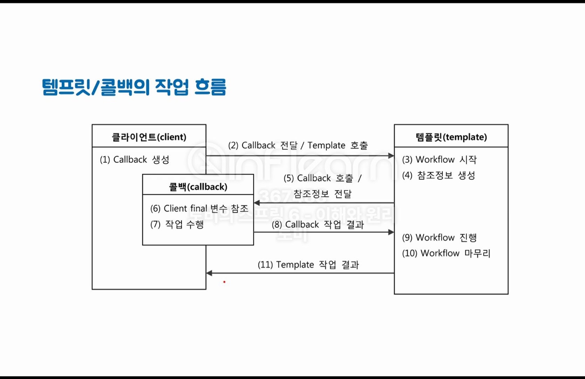
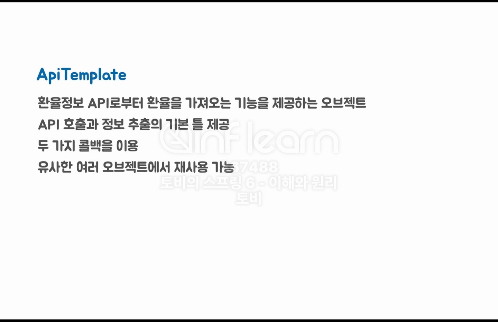

# 강의 내용 정리

## 요구사항
- 해외직구를 위한 원화 결제 준비 기능 개발
- 주문번호, 외국 통화 종류, 외국 통화 기준 결제 금액을 전달 받아서 다음의 정보를 더해 Payment를 생성한다.
  - 적용환율
  - 원화 환산 금액
  - 원화 환산 금액 유효시간
- PaymentService.prepare() 메소드로 개발
  - Payment 오브젝트 리턴

## 개발 방법
- 빠르게 완성해서 가장 간단한 방법을 찾는다.
- 작성한 코드가 동작하는지 확인하는 방법을 찾는다.
- 조금씩 기능을 추가하고 다시 검증한다.
- 코드를 한눈에 이해하기 힘들다면 코멘트로 설명을 달아준다.
  - 3초 이내에 이해가 되지 않는다면 안티패턴일 수 있지만 이해가 되지 않는다면 달아두는게 좋고 해결하는 방법이 있다.

* Gradle
> JVM 환경에서 사용할 수 있는 범용적인 개발 도구  

* settings > gradle
> build 를 gradle 이 아닌 idea 로 변경하는게 좀더 빠르다.

* 돈 관련된 숫자 타입을 사용할 때는 BigDecimal 타입을 사용한다.

## 오브젝트와 의존관계
> 스프링에서 가장 중요한 용어들

### 오브젝트
> 오브젝트를 만들기 위해서 클래스를 작성한다.(청사진)
> 클래스의 인스턴스 = 오브젝트
> 인스턴스 - 추상적인 것(클래스)의 실체
> 자바에서는 배열(Array)도 오브젝트

### 의존관계
> 클래스 레벨의 의존관계, 런타임 레벨의 의존관계 
> Supplier 가 변경되면 Client 코드가 영향을 받는다.
> 하나의 클래스에서 다른 클래스를 사용하고 있다면 사용의존관계라고 이야기한다.

## 관심사의 분리(SoC)
> 관심사가 다른 건 분리해야한다.
> 기술적인 로직과 업무(비지니스)로직이 섞이면 코드를 이해하는데 어려움이 있을 수 있다.
> 관심사는 변경과 관련이 있다.
> 변경의 이유, 시점이 다른 코드를 같이 두는건 좋지 않다.
> 관심 분리 방법 1 - 메서드 추출
> 관심 분리 방법 2 - 클래스 추출
  > 재사용을 위해
  > 확장성을 위해
  > 상속 - 확장성 코드를 만들 때 사용할 수도 있다.
> "상속을 통한 확장"은 한계가 있다.

## 클래스의 분리 (TODO: 다시듣기)
> 상속을 통한 확장을 통해 필요한 메서드로 변경을 할 수 있었지만...

## 인터페이스의 도입
> 인터페이스를 생성하여 메서드를 선언하고 해당 메서드를 구현하는 클래스들을 작성함으로써 
> 최소한의 코드 변경으로 구현클래스를 변경할 수 있게 되었다.
> 그러나 여전히 결합도가 높은 상태이다. 여전히 비지니스 로직 클래스 파일을 수정해야하기 때문

## 관계설정 책임의 분리
> 런타임 의존관계, 코드레벨 의존관계
> 인터페이스의 도입으로 인터페이스에 의존하는 것 같지만 사실 인터페이스와 구현클래스 모두에 의존하고 있는 것 이다.
> 변경이 생기면 책임을 가진 곳도 변경이 일어나야합니다.
> 변경을 하지 않으려면 의존관계를 설정하는 부분을 분리시킨다.
> 분리방법은 변경되는 클래스 앞에 하나를 더 두고 의존관계를 전달하는 것이다.

## 오브젝트 팩토리
> 클래스 앞에서 의존관계를 전달 받았지만 전달하는 쪽(Client)에서도 
> 두가지 역할(1.의존관계 설정, 2.서비스로직 호출)을 맡게 되어 의존관계를 설정하는 클래스를 추가로 분리하였다.

## 원칙과 패턴
> 관심사의 분리로 코드를 변화를 해왔다.
> 객체지향 원칙
> 객체치향적 패턴

1. 개방 폐쇄 원칙(OCP) Open-Closed Principle
> 클래스나 모듈은 확장에는 열려 있어야하고 변경에는 닫혀 있어야한다.  
> 어떤 부분은 열리고 어떤부분은 닫혀 있어야한다.  
> 정리 : 클래스의 기능을 확장할 때 클래스의 코드는 변경되면 안된다.  

2. 높은 응집도와 낮은 결합도
> 응집도가 높다는 것은 하나의 모듈이 하나의 책임 또는 관심사에 집중되어있다는 뜻.  
> 변화가 일어날 때 해당 모듈에서 변하는 부분이 크다.  

> 책임과 관심사가 다른 모듈과는 낮은 결합도, 즉 느슨하게 연결된 형태를 유지하는 것이 바람직하다.    
> 변화가 일어날 때 비용이 적게 든다.  
> 소프트웨어의 품질이 올라가고 높은 유지보수성을 가진다. 라고 이야기할 수 있다.  

3. 전략 패턴
> 자신의 기능 맥락(context)에서, 필요에 따라서 변경이 필요한 알고리즘을  
> 인터페이스를 통해 통째로 외부로 분리시키고, 이를 구현한 구체적인 알고리즘 클래스를    
> 필요에 따라 바꿔서 사용할 수 있게 하는 디자인 패턴  

4. 제어의 역전(Inversion of Control)
> 제어권의 이전을 통한 제어관계 역전 - 프레임워크의 기본 동작 원리  
> 권한을 가지고 하던 작업이 다른 곳으로 넘어갔구나 -> 제어의 역전 (이렇게 이해해도 충분)  

* 스프링을 사용함으로써 얻게되는 장점이자 얻어야하는 목적
> 코드의 품질, 유지보수성을 높이고 잘 확장되면서도 불필요한 변경에는 닫혀있는 상태로 개발할 수 있게 하는 것  

## 스프링 컨테이너와 의존관계 주입(Dependency Injection)
> 스프링 = 스프링컨테이너
> IoC/DI 를 제공하는 컨테이너다.
> Bean 은 오브젝트라고 생각해도 되고 오브젝트중에서도 어플리케이션을 구성하고 있는 기능을 제공하고 담당하는 핵심 클래스의 오브젝트
> 컨테이너 : 오브젝트를 생성하여 가지고 있으며 하나의 오브젝트로 여러 쓰레드(사용자)가 사용 가능하여 성능저하를 막아준다.
> 추가로 만들어진 오브젝트 사이에 관계까지 설정해준다 해서 DI(IoC) 컨테이너라고 불린다.  

## 구성정보를 가져오는 다른 방법
> @Component 를 사용해서 @Bean으로 등록
> 빈은 자바의 컴포넌트 기술
> 빈 혹은 컴포넌트라고 부르기도 한다.
> @ - 메타프로그래밍 기법
> 스프링이 필요로 하는 것은 빈에 대한 정보이다.
> 빈의 정보를 전달하는 방법은 많다.

## 싱글톤 레지스트리(Singleton Registry)
> 스프링은 기본적으로 싱글톤 레지스트리로 동작하게 되어있다.
> 특별한 설정을 하지 않는다면 빈 오브젝트는 싱글톤으로 딱 한 개만 만든다.
> 스프링에서 빈 오브젝트는 싱글톤 레지스트리로 한 개만 만들어져서 여러 다른 오브젝트들에서 사용이 되더라도 동일한 오브젝트가 사용된다.

## DI와 디자인 패턴
> 1. Purpose
> 2. Scope
>   - Class : 상속
>   - Object : 합성 - 오브젝트 두개를 만들어서 런타임에 의존관계를 가지고 사용하게 만들자

> 캐시(Cache)의 도입
> 데코레이터(Decorator) 디자인패턴

## 의존성 역전 원칙(DIP)
> 1. 상위 수준의 모듈은 하위 수준의 모듈에 의존해서는 안 된다. 둘 모두 추상화에 의존해야 한다.
- 하위 수준의 모듈이 상위 수준의 모듈에 의존하도록 만들어라.
- 응집도가 높고 결합도가 낮은 것을 모듈이라고 이야기한다.
- jar 도 하나의 모듈이라고 할 수 있고 패키지로 잘 구분해둔 것들은 jar 로 분리를 할 수 있어서 모듈이라고 부를 수 있다.
- Policy Layer(정책, 비지니스)(상위), Mechanism(기술)(하위) Layer 로 나눌 수 있다.
- 추상화에 의존해야한다. -> 인터페이스에 의존하게 만든다.

> 2. 추상화는 구체적인 사항에 의존해서는 안 된다. 구체적인 사항은 추상화에 의존해야 한다.

> 3. 인터페이스 소유권의 역전이 필요하다.
- Separated interface 패턴 
- 인터페이스는 어느 패키지에 들어있어야 하는가 라는 이야기 
- 인터페이스는 자기를 구현한 쪽이 아닌 사용하는 쪽에 있는 것이 자연스러운 경우가 많다.

## 섹션 3 : 테스트 (TEST)
### 자동으로 수행되는 테스트
> 수동 테스트의 한계  
  > 수동 확인은 불편하다.  
  > UI 까지 개발한 뒤 확인하는 방법은 테스트가 실패했을 때 확인할 코드가 많다.  
  > 테스트할 대상이 많아질 수록 검증하는데 시간이 많이 걸리고 부정확함  

> 작은 크기의 자동으로 수행되는 테스트  

> 개발자가 만드는 테스트  
  > 개발한 코드에 대한 검증 기능을 코드로 작성한다.  
  > 자동으로 테스트를 수행하고 결과를 확인하다.  
  > 테스팅 프레임워크를 활용한다.  
  > 테스트 작성과 실행도 개발 과정의 일부이다.  

### JUnit 테스트 작성
> JUnit 5  
> - @Test 테스트 메소드  
> - @BeforeEach 테스트   
>   - 각 테스트 전에 실행된다.

### PaymentService 테스트

### 테스트의 구성 요소
- PaymentService 테스트의 문제점
  - 1. 우리가 제어할 수 없는 외부 시스템에 문제가 생기면?
  - 2. ExRateProvider 가 제공하는 환율 값으로 계산한 것인가?
  - 3. 환율 유효 시간 계산은 정확한 것인가?

### 테스트와 DI(1)
> 테스트 대상 SUT SYSTEM UNDER TEST
> 테스트 - 테스트 대상 - 협력자(COLLABORATOR), 협력자(COLLABORATOR
> 테스트를 하는 동안에만 사용할 테스트 협력자를 만들어서 진행한다.
> 테스트 협력자 예시) ExRateProviderStub 
>   - *Stub - 담배꽁초
>   - Imposter, Test Double 라고 불리기도 한다.
> 우연히 테스트가 통과할 수 있기 때문에 2가지 정도 케이스를 만들어서 테스트 해보는 것이 좋은 습관이다.

> 오브젝트가 적절한 의존관계를 갖게하고 인터페이스를 사이에 두고 분리시키고 
> 인터페이스를 구현한 클래스를 외부에서 결정을 해서 생성자를 통해서 주입하도록 만드는 의존관계주입을 만들지 않았다면 테스트가 쉽지 않다.

> BigDecimal 에 대해서 자세히 알아보자!
> 값을 비교할 때 주의하자 ex) 자릿수

### 테스트와 DI(2)
#### 스프링 DI를 이용하는 테스트
> 테스트용 협력자(Collaborator)/의존 오브젝트를 스프링의 구성 정보를 이용해서
> 지정하고 컨테이너로부터 테스트 대상을 가져와서 테스트
> @ContextConfiguration, @Autowired

#### @ContextConfiguration
> 아래 둘은 한쌍으로 사용한다. 기계적으로 사용
> @ExtendWith(SpringExtension.class)
> @ContextConfiguration(classes = TestObjectFactory.class)
> 컨테이터 테스트가 가능하다.
> 테스트는 자주 실행해주는게 좋다.

#### @Autowired
> -

### 학습 테스트
> 직접 만들지 않은 코드, 라이브러리, 레거시 시스템에 대한 테스트
> 테스트 대상의 사용방법을 익히고 동작방식을 확인하는데 유용하다.
> 외부 기술, 서비스가 버전이 올라갔을 때 이전과 동일하게 동작하는지 확인할 수도 있다.
> 가이드라인처럼 학습테스트로 작성하는 것도 좋다.

### Clock을 이용한 시간 테스트
> 외부라이브러리를 빈 컨테이너에서 사용할 수 있도록 할 수 있다.

### 도메인 오브젝트 테스트(테스트의 꽃)
> 환경이 되지 않더라도 했으면 하는 한다.

#### 도메인 모델 아키텍처 패턴
> 도메인 로직, 비지니스 로직을 어디에 둘 지를 결정하는 패턴
> 1. 트랜잭션 스크립트 - 서비스 메소드(PaymentService.prepare)
> 2. 도메인 모델 - 도메인 모델 오브젝트(Payment)
>    - 테스트를 만들기가 쉽다.
> 테스트를 만들어서 비지니스 로직을 개발하는데 시간이 오래걸린다는 생각이 든다면
> 테스트를 작성하는 여러가지 툴과 방법을 익혀서 다른 사람들이 비지니스로직만 작성할 때 
> 동시에 테스트도 같이 작성할 수 있도록 노력해보자.
> 적어도 도메인 테스트는 작성하자!

## 섹션 5 - 템플릿
### 스프링과 JDK 업그레이드
> 스프링 버전업 과정
> 프로젝트를 새로 생성하고 생성된 프로젝트의 여러 설정값을 복사한다.

### 다시 보는 개방 폐쇄 원칙
> 개방 폐쇄 원칙(OCP)
> 어떤 부분은 확장하려는 부분과 변하지 않으려는 부분이 있는데 혼재되어있는 경우가 많다.
> 변화의 특성이 다른 부분을 구분하고 각각 다른 목적과 이유에 의해 다른 시점에 독립적으로 변경될 수 있는 효율적인 구조를 만들어야 한다.

#### 템플릿
> 코드 중에서 "변경이 거의 일어나지 않으며 일정한 패턴으로 유지되는 특성을 가진 부분"(템플릿)을  
> "자유롭게 변경되는 성질을 가진 부분"(콜백)으로부터 독립시켜서 효과적으로 활용할 수 있도록 하는 방법  
> 템플릿 콜백 패턴이라고 부르기도 한다.  

### WepApiExRateProvider 리팩터링
> 리팩터링 - 기능을 변경하지 않고 구조만 개선하는 것
> 끊임없이 리팩터링을 하는 것이 좋다.
> 리팩터링을 하고 난 뒤 기능이 변경되지 않음을 확인하는 좋은 방법은 "테스트"를 작성하는 것이다.
> 언체크드 EX - 런타임 EX로 앞단에 전달한다.
> 런타임 EX는 throws 가 없어도 앞단까지 전달한다.
> try with resource 
>  - AutoCloseable 을 구현한 클래스는 try with resource 안에 선언 시 자동으로 close 한다.

### 변하는 코드 분리하기 - 메소드 추출
> 변경되지 않는 코드와 변경되거나 확장될 수 있는 코드를 분리한다.

### 변하지 않는 코드 분리하기
> 템플릿 - 템플릿은 어떤 목적을 위해 미리 만들어둔 모양이 있는 툴  
> 고정된 틀 안에 바꿀 수 있는 부분을 넣어서 사용하도록 만들어진 오브젝트  
> 템플릿 메소드 패턴도 템플릿을 사용  

#### 템플릿 메소드 패턴 
> 템플릿 메소드 패턴은 고정된 틀의 로직을 가진 템플릿 메소드를 슈퍼클래스에 두고,
> 바뀌는 부분을 서브클래스의 메소드에 두는 구조로 이뤄진다.

> 메서드 명을 작성할 때 기능에 대한 설명보다는 목적에 대한 내용이 들어있으면 좋다.

> 외부 서비스를 사용하는 경우 의존도를 낮추는 것이 좋다.

### ApiExecutor 분리(인터페이스 도입과 클래스 분리)
> 한번에 전체를 변경하려 하지말고 순차적으로 개선해 나아가는 방법을 생각해보자

### ApiExecutor 콜백과 메소드 주입
> 클라이언트가 콜백을 만들어서 템플릿을 호출한다.  

#### 콜백(Callback)
> 콜백은 실행되는 것을 목적으로 다른 오브젝트의 메소드에 전달되는 오브젝트 파라미터로  
> 전달되지만 값을 참조하기 위한 것이 아니라 특정 로직을 담은 메소드를 실행 시키는 것이 목적  
> 하나의 메소드를 가진 인터페이스 타입(SAM)의 오브젝트 또는 람다 오브젝트

#### 템플릿/콜백은 전략 패턴읜 특별한 케이스
> 템프릿은 전략패턴의 컨텍스트  
> 콜백은 전략 패턴의 전략
> 템플릿/콜백은 메소드 하나만 가진 전략 인터페이스를 사용하는 전략 패턴

#### 메소드 주입
> 의존 오브젝트가 메소드 호출 시점에 파라미터로 전달되는 방식
> 의존관계 주입의 한 종류
> 메소드 호출 주입(method call injection)이라고도 한다.

#### 익명 클래스
> 클래스의 정의와 클래스 오브젝트를 생성하는 것을 동시에 해준다.

### ExRateExtractor 콜백

> (왜 분리를 해야하는지 다시 보고 작성 필요)

### ApiTemplate 분리
> 환율정보 API의 기본 틀
  
> 메소드로만 분리했던 템플릿을 오브젝트로 분리하는 과정  
> *우리는 저자라고 생각하면서 나를 포함한 다른 사람을 위해 적절한 코멘트를 작성하거나 메소드 명을 변경합니다.    
> JAVA11 부터 WebApi 기능을 지원하는 HttpClient 기능이 추가 되었다.

### 디폴트 콜백과 템플릿 빈
> 재사용 가능한 Template Bean
> 디폴트 콜백도 생성자를 통해서 변경을 할 수 있도록 하는걸 추천한다.